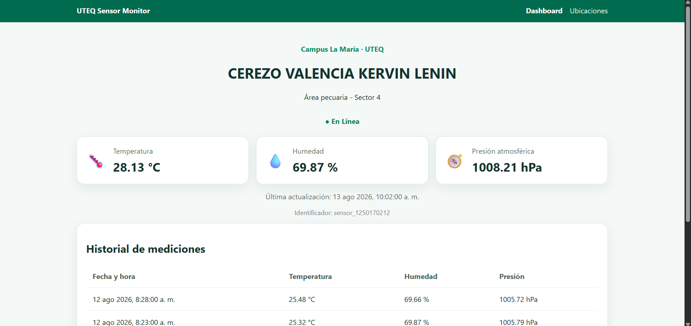

# Monitoreo App

## Descripción General

**Monitoreo App** es una aplicación web desarrollada para el monitoreo y control de sistemas en tiempo real. Proporciona una interfaz intuitiva que permite a los usuarios visualizar el estado de diversos componentes del sistema, recibir alertas y realizar acciones correctivas de forma inmediata.

## Características Principales

### 📊 Dashboard Interactivo
- Visualización en tiempo real del estado de sistemas
- Gráficos estadísticos y métricas de rendimiento
- Indicadores visuales de alertas y estados críticos

### 🔔 Sistema de Notificaciones
- Alertas instantáneas para eventos críticos
- Notificaciones personalizables según el nivel de severidad
- Historial completo de eventos y cambios

### 📈 Análisis de Datos
- Reportes detallados de rendimiento
- Análisis histórico de tendencias
- Exportación de datos en múltiples formatos

### ⚙️ Control de Sistemas
- Interfaz de control remoto
- Configuración de parámetros del sistema
- Gestión de recursos y optimización

## Pantalla Principal



*Pantalla principal de la aplicación mostrando el dashboard de monitoreo en tiempo real*

## Tecnologías Utilizadas

- **Frontend**: HTML5, CSS3, JavaScript
- **Backend**: Node.js / Express
- **Base de Datos**: MongoDB / PostgreSQL
- **Comunicación en Tiempo Real**: WebSocket

## Instalación

```bash
npm install
npm start
```

## Uso

1. Acceder a la aplicación a través del navegador
2. Iniciar sesión con tus credenciales
3. Navegar por el dashboard para monitorear sistemas
4. Configurar alertas según tus necesidades

## Licencia

Este proyecto está bajo licencia MIT.
